# Telaprolu Lakshmi Srinivas

<p align="center">
  <picture>
    <source media="(prefers-color-scheme: dark)" srcset="./dark.svg">
    <source media="(prefers-color-scheme: light)" srcset="./light.svg">
    
  </picture>
</p>

> AI Engineer focused on **LLMs, RAG, Agentic AI, NLP, and AI automation**. Currently pursuing an **M.Tech in Artificial Intelligence at IIT Roorkee**.

## About

I build practical AI systems that connect research with production engineering. My work spans LLM applications, retrieval-augmented generation, agentic workflows, fine-tuning, backend services, and enterprise automation.

- **Current:** M.Tech Artificial Intelligence @ IIT Roorkee
- **Previous:** B.Tech CSE (AI) @ IIITDM Kancheepuram
- **Experience:** Accenture — AI & Enterprise Automation
- **Research:** Legal AI, RAG, information retrieval
- **Goal:** Build AI systems that solve real-world problems.

## Experience

### Accenture — Advanced App Engineering Analyst
**Oct 2025 → Jul 2026**

- Developed AI-powered agents for enterprise workflows.
- Built Python-based RHEL patching automation for Oracle RAC.
- Increased patching throughput from 4–6 systems/day to 15–20 systems in ~3 hours.
- Developed a centralized automation monitoring dashboard.
- Modernized Oracle GoldenGate automation from Shell to Python.
- Implemented checkpoint recovery, logging, and automated notifications.

### Vizzhy Inc — Hanooman.ai — Artificial Intelligence Intern
**May 2024 → Oct 2024**

- Worked on LLM fine-tuning and evaluation.
- Built data collection and preprocessing pipelines.
- Developed FastAPI backend services.
- Worked with web scraping and AI application development.

## Featured Projects

### ⚖️ NyayaMitra
**AI-Powered Legal Assistant & RAG-Based Case Retrieval**

- 200K+ Indian court judgments
- BGE embeddings + Milvus
- Phi-3 Mini + LoRA/PEFT
- RAG-based legal question answering
- Prior case / precedent retrieval
- FastAPI backend
- Published at **MIKE 2025**

[Repository](https://github.com/srinivastls/NyayaMitra)

### 🛡️ 91-crpc
**AI-Powered Scam Detection & Investigation System**

- GPT-4o + RoBERTa
- Scam detection from chat conversations
- AI-powered decoy conversation agents
- Structured digital evidence extraction
- 40+ FastAPI REST APIs
- Investigation workflow automation

[Repository](https://github.com/srinivastls/91-crpc)

### 📦 cp_snippets
**Competitive Programming Toolkit**

- Python package
- Reusable algorithms and data structures
- Competitive programming utilities
- Automated documentation
- GitHub Actions

[Repository](https://github.com/srinivastls/cp_snippets)

### 📱 Smart Expense Tracker
**Personal Finance Management Application**

- Flutter
- SQLite
- Offline-first architecture
- Expense and income tracking
- Categories and budgeting
- CSV export
- Published on Google Play

## Technical Stack

**Artificial Intelligence:** Machine Learning · Deep Learning · LLMs · Generative AI · RAG · Agentic AI · NLP · Fine-tuning · LoRA · PEFT

**Frameworks:** PyTorch · TensorFlow · Hugging Face · Transformers · LangChain · LangGraph · FastAPI · Flask

**Programming:** Python · C++ · C · SQL · TypeScript

**Data & Infrastructure:** Milvus · FAISS · MySQL · Docker · Kubernetes · Linux · Git · GitHub Actions · GCP · Azure OpenAI

## Research

### AI-Powered Legal Assistant and RAG-Based Case Retrieval System

- **Domain:** Legal AI
- **Dataset:** 200K+ Indian court judgments
- **Retrieval:** Dense Vector Search
- **Embeddings:** BGE
- **Vector DB:** Milvus
- **LLM:** Phi-3 Mini
- **Fine-tuning:** LoRA / PEFT
- **Publication:** MIKE 2025

## Achievements

- **AIR 253 — GATE 2024 Data Science & AI**
- GATE qualified — CS & DA across multiple years
- Published Research — MIKE 2025
- M.Tech Artificial Intelligence — IIT Roorkee
- AI & Enterprise Automation — Accenture
- Founder & Head — Developers Club, IIITDM
- Placement Cell Coordinator — IIITDM
- Teaching Assistant — IIITDM

## Open Source

I build reusable tools and libraries that make development faster.

**cp_snippets**
- Language: Python
- Documentation: MkDocs
- Automation: GitHub Actions
- Focus: Algorithms · Data Structures · CP Utilities

## Connect

- [GitHub](https://github.com/srinivastls)
- [LinkedIn](https://www.linkedin.com/in/srinivastls/)
- [Portfolio](https://srinivastls.me/)
- [Email](mailto:lakshmisrinivas365@gmail.com)

---

```console
guest@srinivastls:~$ cat mission.txt

Build practical AI.
Publish meaningful research.
Ship products people actually use.
Keep learning.
```

<p align="center">
  <sub>Premium terminal-style profile banner · dark/light theme aware · self-contained SVG · SMIL animation only</sub>
</p>
